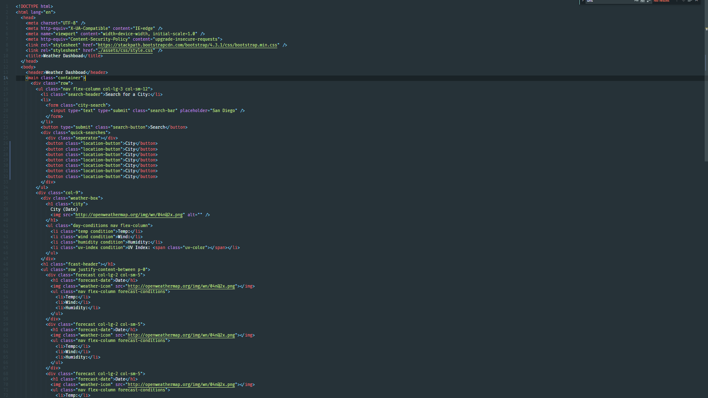
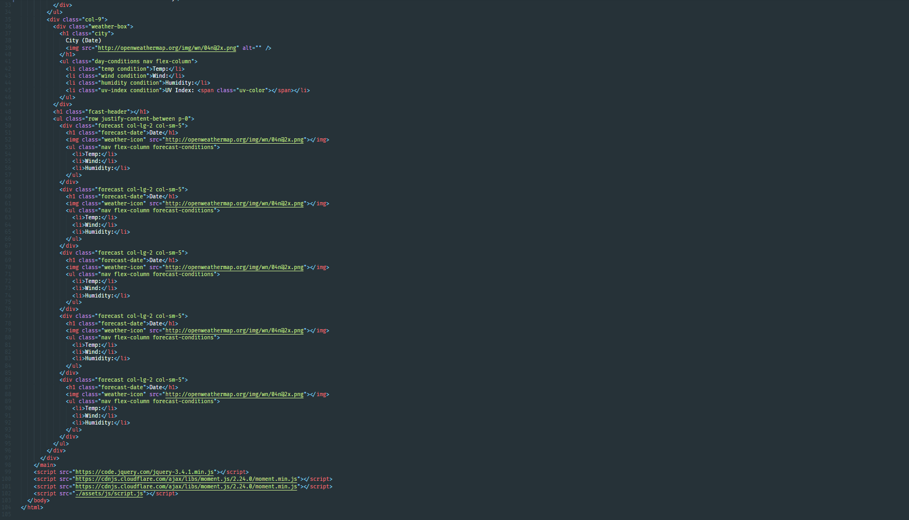
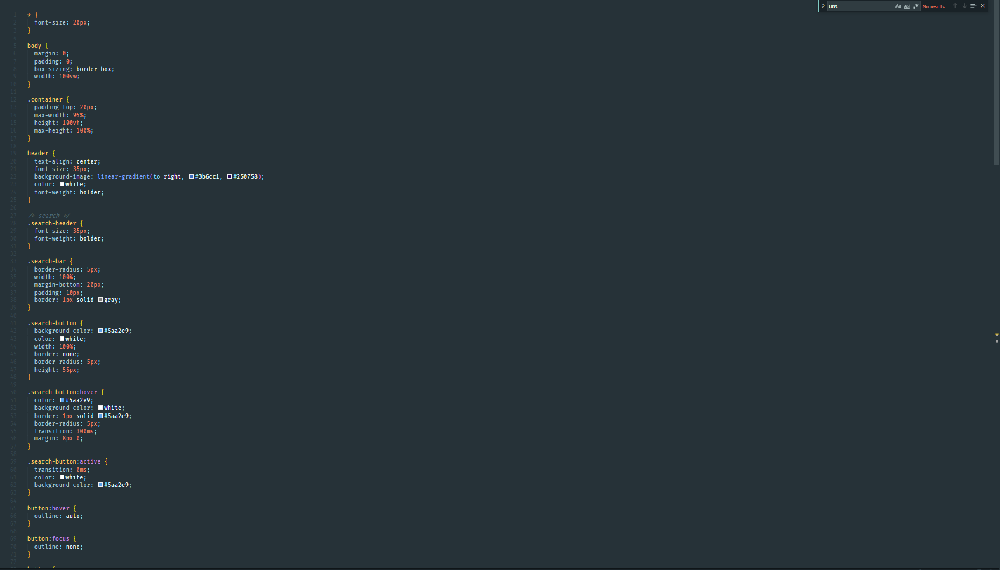
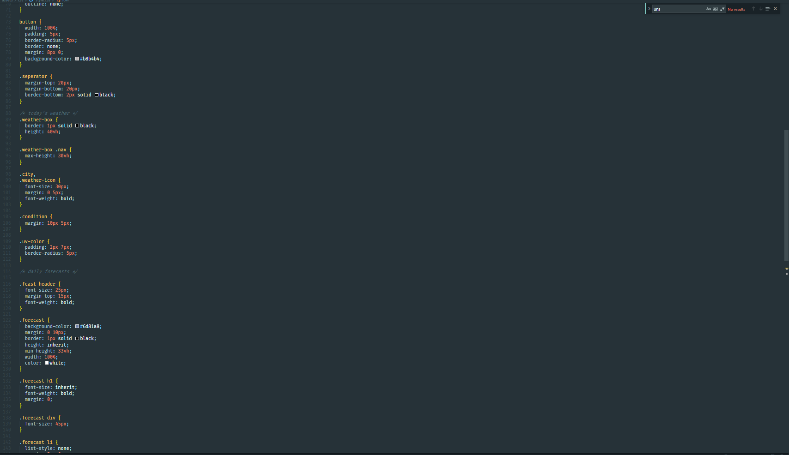
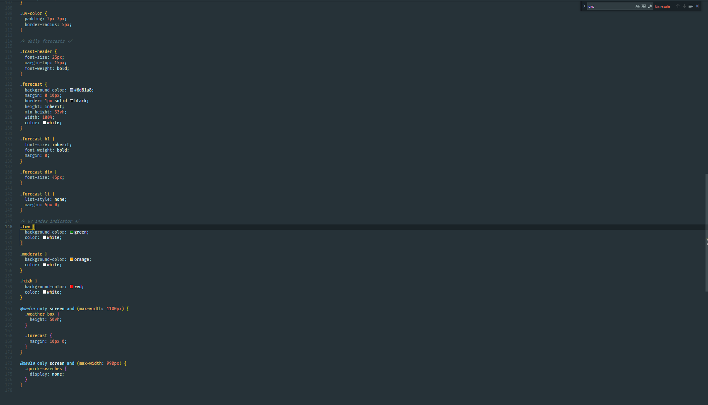
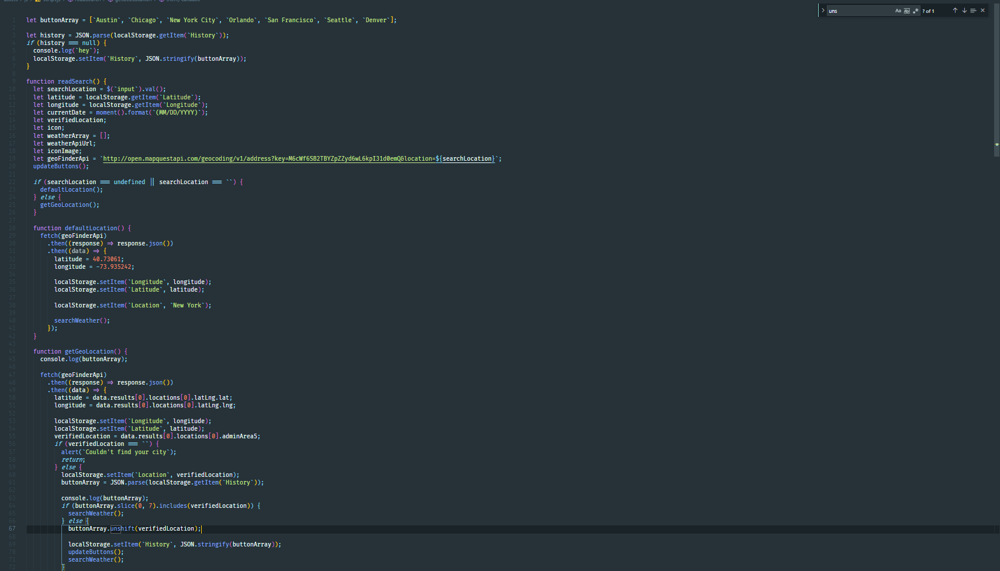
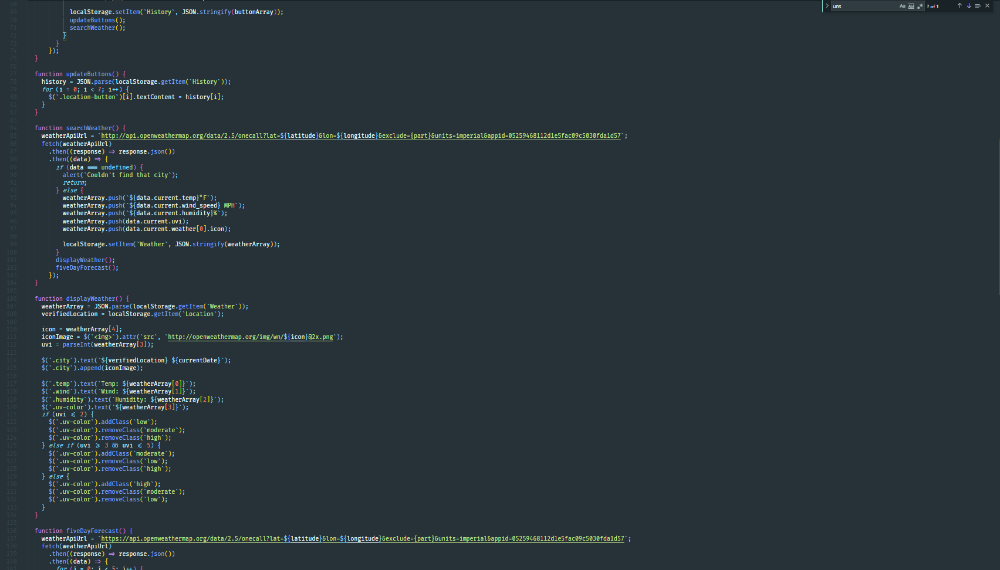
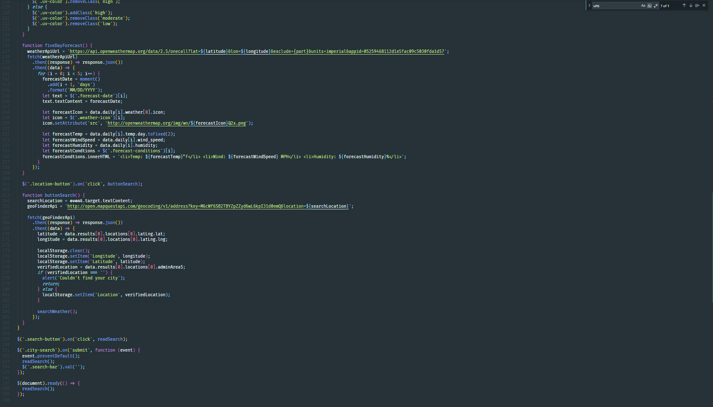

# Weather Dashboard

## Description

In this challenge server APIs were used to create a weather application that allows the user to search for a city and gives and returns weather conditions, a five day forecast and a list of previously searched cities as history.

## Screenshots

### HTML

### CSS

### JS

## Links

https://lclark31.github.io/weather-dash/
